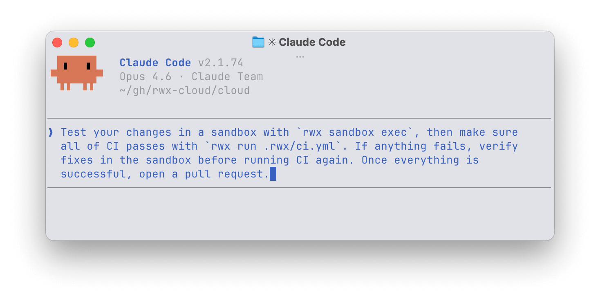

# RWX

<p align="center">
  
</p>

The agent-native cloud platform for sandboxes, CI pipelines, and building container images.

RWX gives developers and AI agents a programmatic interface to run code in the cloud with sub-second cached builds, DAG-based parallelization, and structured output. Developers and agents can iterate on changes until CI passes — without a single commit or push.

Powered by an [accelerated container runtime](RUNTIME.md).

## Features

- **DAG-based execution** — Define task dependencies as a graph. RWX determines optimal ordering and runs independent tasks in parallel automatically.
- **Content-based caching** — Results are cached based on filesystem contents and reused across runs. Individual tasks cache independently, so a single cache miss doesn't invalidate everything.
- **Right-sized compute** — Each task specifies its own CPU and memory requirements, up to 64 cores. No fixed runner sizes.
- **Agent-native** — Trigger builds from the CLI and iterate on changes before pushing. AI agents and developers get immediate feedback loops with `rwx run --wait`, `rwx results`, `rwx logs`, and `rwx artifacts` — all with `--output json` for machine-readable results.
- **Container image builds** — Build OCI-compatible images [without Dockerfiles](RUNTIME.md#building-container-images-without-dockerfiles). Tasks execute on separate machines in parallel and combine into a single image.
- **Semantic output** — Structured results rather than raw logs. Failed tests, filesystem contents, and detailed diagnostics are accessible programmatically.
- **Remote debugging** — SSH into running tasks or set breakpoints to inspect intermediate state.

## Install the RWX Skill

The [RWX Skill](https://www.rwx.com/blog/rwx-skill) gives AI coding agents direct access to RWX — agents can find relevant documentation, lint run definition files, and validate changes with real RWX runs. The skill provides deterministic tools instead of relying on web searches, so agents generate accurate run definitions from scratch or migrate existing ones from platforms like GitHub Actions.

**Claude Code:**

```sh
/install-skill rwx
```

**Cursor, GitHub Copilot, OpenAI Codex, and other agents:**

```sh
npx skills add rwx-cloud/skills
```

Once installed, agents can:

- `/rwx` — Invoke the skill directly with a prompt
- `rwx docs search <query>` — Search RWX documentation
- `rwx lint` — Validate run definition syntax
- `rwx run <file> --wait` — Execute runs and iterate until they pass
- `rwx logs` / `rwx artifacts` — Debug failures programmatically
- `rwx packages list` / `rwx packages show` — Browse built-in packages

## Getting Started

### Install the CLI

**macOS & WSL:**

```sh
brew install rwx-cloud/tap/rwx
```

**Linux:**

Download the latest release from [GitHub](https://github.com/rwx-cloud/cli/releases) for your platform, then move the binary to a directory in your `PATH`.

### Authenticate

```sh
rwx login
```

Verify with `rwx whoami`. You'll need an [RWX Cloud account](https://cloud.rwx.com/_/signup) and an [organization](https://cloud.rwx.com/_/organizations/new).

### VS Code Extension

```
ext install RWX.rwx-vscode-extension
```

Or find it on the [VS Code Marketplace](https://marketplace.visualstudio.com/items?itemName=RWX.rwx-vscode-extension).

### Run your first task

Create a `tasks.yml`:

```yaml
base:
  image: ubuntu:24.04
  config: rwx/base 1.0.0

tasks:
  - key: hello-world
    run: echo hello world
```

```sh
rwx run tasks.yml --open
```

The CLI outputs a URL to view results. The `--open` flag launches your browser automatically.

## Connect to GitHub

Install the [RWX GitHub App](https://github.com/apps/rwx-integration) to trigger runs on push and report commit status checks back to GitHub.

Create `.rwx/push.yml` in your repository:

```yaml
on:
  github:
    push:
      init:
        commit-sha: ${{ event.git.sha }}

base:
  image: ubuntu:24.04
  config: rwx/base 1.0.0

tasks:
  - key: code
    call: git/clone 2.0.3
    with:
      github-token: ${{ github.token }}
      commit-sha: ${{ init.commit-sha }}

  - key: test
    use: [code]
    run: echo "tests pass"
```

Push the commit and a status check appears on the commit in GitHub.

To run locally against any commit:

```sh
rwx run .rwx/push.yml --init commit-sha=$(git rev-parse HEAD) --open
```

See the full [GitHub integration guide](https://www.rwx.com/docs/getting-started/github).

## Connect to GitLab

Configure a GitLab integration from your [RWX organization settings](https://cloud.rwx.com). You'll need a GitLab access token with `api`, `self_rotate`, and `read_repository` scopes. Group tokens work across all projects in a group; project tokens require setup per project.

Create `.rwx/push.yml` in your repository:

```yaml
on:
  gitlab:
    push:
      init:
        commit-sha: ${{ event.git.sha }}

base:
  image: ubuntu:24.04
  config: rwx/base 1.0.0

tasks:
  - key: code
    call: git/clone 2.0.3
    with:
      ssh-key: ${{ gitlab['YOUR_ORG/YOUR_REPO'].ssh-key }}
      commit-sha: ${{ init.commit-sha }}

  - key: test
    use: [code]
    run: echo "tests pass"
```

Push the commit and a Pipeline link appears in GitLab's UI pointing to the RWX run.

See the full [GitLab integration guide](https://www.rwx.com/docs/getting-started/gitlab).

## Sandboxes for Coding Agents

RWX sandboxes give coding agents isolated cloud environments to execute commands — run tests, install dependencies, start services — while the agent stays on your machine with your configuration and oversight.

Initialize a sandbox configuration:

```sh
rwx sandbox init
```

This generates `.rwx/sandbox.yml`. A minimal configuration:

```yaml
on:
  cli:
    init:
      commit-sha: ${{ event.git.sha }}

base:
  image: ubuntu:24.04
  config: rwx/base 1.0.0

tasks:
  - key: code
    call: git/clone 2.0.3
    with:
      preserve-git-dir: true
      repository: https://github.com/your-org/your-repo.git
      ref: ${{ init.commit-sha }}
      github-token: ${{ github.token }}

  - key: sandbox
    use: code
    run: rwx-sandbox
```

Execute commands in the sandbox:

```sh
rwx sandbox exec -- npm test
```

Local changes automatically sync to the cloud before execution and sync back afterward. The sandbox persists between commands, so state like installed packages and running services carries over.

For more complex setups with background services like databases:

```yaml
  - key: sandbox
    use: [code, docker-images, npm-install]
    docker: true
    background-processes:
      - key: start-databases
        run: docker compose up
        ready-check: rwx-docker-ready-check
    run: |
      npm run migrate
      rwx-sandbox
```

Sandboxes are uniquely identified by working directory, git branch, and config file — so multiple agents working in separate git worktrees each get their own isolated sandbox automatically.

```sh
rwx sandbox list          # List running sandboxes
rwx sandbox stop          # Stop current sandbox
rwx sandbox stop --all    # Stop all sandboxes
rwx sandbox reset         # Reset to fresh state
```

See the full [sandboxes for coding agents guide](https://www.rwx.com/docs/guides/sandboxes-for-coding-agents).

## CI Workflow Example

A typical CI workflow installs system packages, clones the repository, sets up a language runtime, installs dependencies, and runs tests. Here's a Node.js example triggered on pull requests:

```yaml
on:
  github:
    pull_request:
      init:
        commit-sha: ${{ event.git.sha }}

base:
  image: ubuntu:24.04
  config: rwx/base 1.0.0

tasks:
  - key: code
    call: git/clone 2.0.3
    with:
      github-token: ${{ github.token }}
      commit-sha: ${{ init.commit-sha }}

  - key: node
    call: nodejs/install 1.1.11
    with:
      node-version: 20.12.1

  - key: npm-install
    use: [code, node]
    run: npm install
    filter:
      - package.json
      - package-lock.json

  - key: lint
    use: [code, node, npm-install]
    run: npm run lint

  - key: test
    use: [code, node, npm-install]
    run: npm test
```

The `filter` on `npm-install` ensures only changes to `package.json` and `package-lock.json` bust the cache — source code changes skip the install step entirely. `lint` and `test` run in parallel since neither depends on the other.

See the full [CI reference workflow guide](https://www.rwx.com/docs/guides/ci).

## Building Container Images

RWX builds OCI-compatible container images natively — no Dockerfiles or BuildKit required. Tasks run in parallel across distributed infrastructure and combine into a single image. See [RUNTIME.md](RUNTIME.md) for how this works under the hood.

A simple image that runs a script:

```yaml
base:
  image: ubuntu:24.04
  config: none

tasks:
  - key: image
    run: |
      cat <<'EOF' > script.sh
      #!/usr/bin/env bash
      echo "hello from a container built on RWX"
      EOF
      chmod +x script.sh
      echo "$PWD/script.sh" | tee $RWX_IMAGE/command
```

Push the built image to a registry:

```sh
rwx image push <task-id> --to <registry>/<repository>:<tag>
```

A full Node.js image build with dependency caching and multi-stage isolation:

```yaml
base:
  image: node:24.11.0-trixie-slim
  config: none

tasks:
  - key: system
    run: |
      apt-get -y update
      apt-get -y install curl jq
      apt-get -y clean

  - key: code
    use: system
    call: git/clone 2.0.3
    with:
      repository: https://github.com/your-org/your-repo.git
      ref: ${{ init.commit-sha }}
      github-token: ${{ github.token }}

  - key: npm-install
    use: code
    run: npm ci --omit=dev
    filter:
      - package.json
      - package-lock.json

  - key: image
    use: npm-install
    run: |
      echo "node" | tee $RWX_IMAGE/user
      echo "node server.js" | tee $RWX_IMAGE/command
    env:
      NODE_ENV: production
```

Image metadata like `CMD`, `ENTRYPOINT`, `USER`, and `WORKDIR` is set by writing to files under `$RWX_IMAGE/`. The `filter` on `npm-install` ensures dependency changes only bust the cache when `package.json` or `package-lock.json` actually change.

For orchestrating build, push, and test as a complete workflow, use embedded runs to split each phase into its own file. See the full [building container images guide](https://www.rwx.com/docs/guides/build-container-images) and [migrating from Dockerfile](https://www.rwx.com/docs/migrating-from-dockerfile).

## Documentation

- [Getting Started](https://www.rwx.com/docs/getting-started)
- [GitHub Integration](https://www.rwx.com/docs/getting-started/github)
- [GitLab Integration](https://www.rwx.com/docs/getting-started/gitlab)
- [Sandboxes for Coding Agents](https://www.rwx.com/docs/guides/sandboxes-for-coding-agents)
- [CI Reference Workflow](https://www.rwx.com/docs/guides/ci)
- [Building Container Images](https://www.rwx.com/docs/guides/build-container-images)
- [Migrating from Dockerfile](https://www.rwx.com/docs/migrating-from-dockerfile)
- [CLI Reference: `rwx run`](https://www.rwx.com/docs/cli-reference/rwx-run)
- [CLI Reference: `rwx results`](https://www.rwx.com/docs/cli-reference/rwx-results)
- [CLI Reference: `rwx logs`](https://www.rwx.com/docs/rwx/cli-reference/rwx-logs)
- [CLI Reference: `rwx artifacts`](https://www.rwx.com/docs/rwx/cli-reference/rwx-artifacts)
- [MCP Server](https://www.rwx.com/docs/rwx/mcp)
- [Packages](https://www.rwx.com/docs/rwx/packages/git/clone/2.0.0)
- [Tool Caches](https://www.rwx.com/docs/rwx/tool-caches)
- [Concurrency Pools](https://www.rwx.com/docs/concurrency-pools)
- [Release Notes](https://www.rwx.com/docs/rwx/release-notes)

## Support & Community

- [Discord](https://www.rwx.com/discord) — Chat with the engineering team
- [Slack](https://cloud.rwx.com/org/deep_link/manage/support) — Shared channels for existing customers
- [Schedule a call](https://savvycal.com/rwx/30min) — Video conference with the co-founders
- [GitHub Issues](https://github.com/rwx-cloud) — For open source projects
- [Status Page](https://rwx.statuspage.io)

## License

See [LICENSE](LICENSE).
